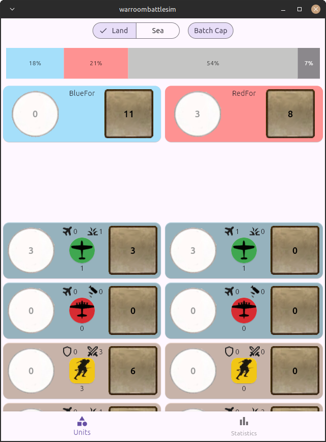

# WR Sim

This app is battle calculator for the board game War Roonm. Simulate the outcome and make smarter decisions than your opponent!

## Installation

Download the latest release from [Releases](https://github.com/terminator-ger/wrbattlesim/releases)
There are currently prebuild packages for Android, Linux and soon Windows.

## FAQ
___
Q: What is the difference between the draw and mutual destruction?

A: When there is a draw both sides still have ground units in the area after the battle and it remains contested. 
When there is a mutual destruction no ground units on both sides survive the combat, land areas remain with the defender. 
This is an important information for the attacker due to the pinning mechanics in the game.

Q: How are hits automatically assigned during combat evaluation?

A: For now i use a priority order to assign free hits (black and white dice) to the most valuable units first. 

Q: How does hit assignment for cruisers in escort stance work?

A: For sea units escort hits are prioritized to be taken for battleships over carriers.

## Disclaimer
This is a fanproject for the board game War Room. It's intent is to help you develop new straegies for the game and help you in your decisions thoughout the game.

## Trademark Notice

> The round WAR ROOM® logo is a registered trademark of Nightingale Games LLC.
> All rights reserved. Used with permission.

## License Exception
> All source code in this repository is licensed under the GNU AGPL v3.0.
> The round WAR ROOM® logo and related trademark assets are not licensed under the AGPL and are used with permission from Nightingale Games LLC.
